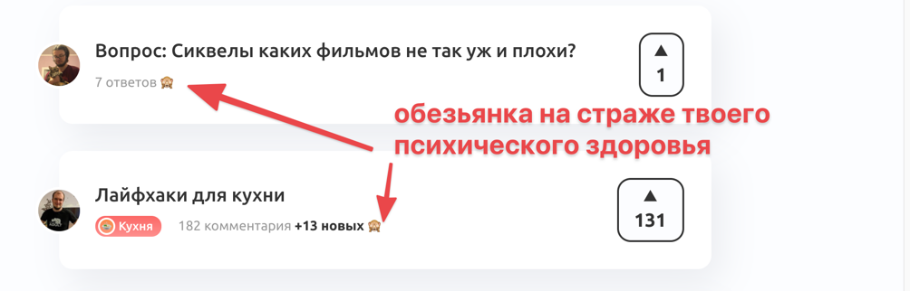
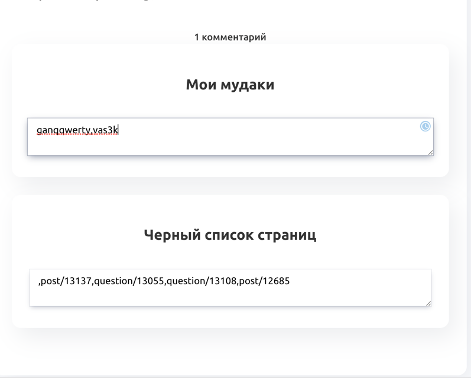
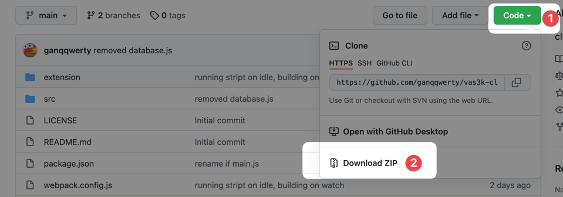
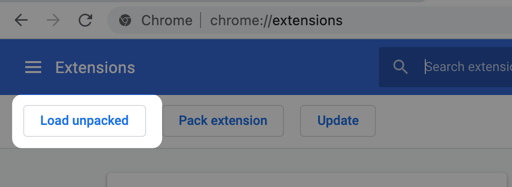

# Вастрик-ыкстеншон

В это расширение мы собираем функции, которые нахер не нужны большинству пользователей Вастрик.Клуба, но страшно необходимы некоторым.

* **Мои Мудаки**. Вас настолько достал определенный пользователь, что вы не хотите видеть ничего, что он пишет? Зайдите на его страничку и добавьте его в Мои Мудаки, и вы ничего больше не узнаете об этой сволочи!
* **Оставить заметку о пользователе**. Зайдите на страницу пользователя и оставьте там заметочку о том, кто он такой вообще.

* **Скрыть пост**. Вы обнаруживаете себя в ковидсрачах, сталинсрачах, фемсрачах или еще чем-нибудь? Долго вините себя в том, что ввязались в это говно? Бросьте это поганое дело, просто нажмите на иконку обезьянки рядом с постом – и пост больше не будет отравлять вам жизнь!

* **Моя страница позволяет редактировать мудаков и скрытые посты**. С помощью прорывной технологии textarea, ты, пользователь, можешь не только добавлять людей в список мудаков, но и удалять их из этого списка! 

## Установка
Скачайте архив вот прям тут и распакуйте его где-нибудь: 

Если у вас Chrome, то зайдите в расширения и нажмите кнопку Load unpacked:

Укажите путь к папке extension внутри папки архива.

## Помогайте кодить! Пишите багрепорты!

Когда я был маленьким второкурсником и уже основательно владел Турбо Паскалем, мне хотелось закодить все. Потому что круто было взять и что-то закодить. Иногда я нахожу это ощущение снова, и этот проект – как раз этот случай. 

Вам кажется, что textarea на странице пользователя – говно, и надо сделать красивые виджеты постов и людей? Пишите мне в телегу ganqqwerty и давайте вместе это захерачим! Особенно отлично, если вы умеете писать на ванильном джс-е, ведь я решил принципиально не использовать никаких библиотек. Почему? Потому что я не представляю как без ангуляра с реактом сделать хоть что-нибудь, чтобы глаза не вытекли, хоть и являюсь фронтендером с шестилетним опытом.   
